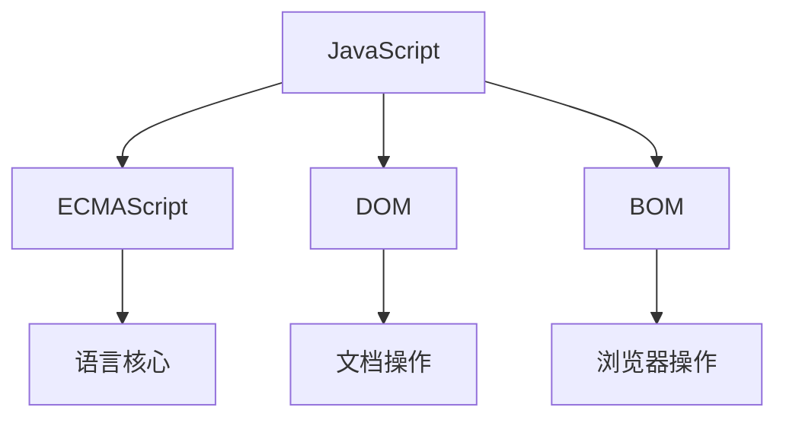

---
nav:
  title: 笔记
  path: /notes
group:
  title: 语言基础
  order: 1
---

# JavaScript 的发展历史

JavaScript 从诞生到现在经历了多个重要的发展阶段，每个阶段都为这门语言带来了重大的改变和进步。

## 诞生阶段 (1995-1999)

### Brendan Eich 的 10 天

- 1995 年，Brendan Eich 在网景公司用 10 天时间创造了 JavaScript
- 最初名为 Mocha，后改名为 LiveScript
- 为了蹭 Java 的热度，最终改名为 JavaScript
- 设计目标是为网页添加交互能力

### 标准化

- 1997 年，JavaScript 1.1 被提交给 ECMA 标准化组织
- ECMA-262 标准诞生，语言标准被命名为 ECMAScript
- 1999 年，ECMAScript 3 发布，奠定了语言的基础特性

## 停滞期 (2000-2008)

这段时间 JavaScript 的发展相对停滞：
- ECMAScript 4 提案因过于激进而被放弃
- 浏览器大战导致 Web 标准发展混乱
- jQuery 等库的兴起，填补了标准的空缺

## 现代化转型 (2009-2015)

### ECMAScript 5

2009 年发布的 ES5 带来了重要更新：
- 严格模式（'use strict'）
- JSON 原生支持
- 数组方法扩展（map、filter、reduce 等）
- Object 的 getter/setter

### ECMAScript 6 (ES2015)

2015 年的 ES6 是一个里程碑式的版本：

```javascript
// 类的支持
class Person {
  constructor(name) {
    this.name = name;
  }
}

// 箭头函数
const sum = (a, b) => a + b;

// 解构赋值
const { name, age } = person;

// Promise
new Promise((resolve) => {
  resolve('done');
});

// 模块化
import { useState } from 'react';
export default App;
```

主要特性：
- 类和继承
- 箭头函数
- 解构赋值
- Promise
- 模块化
- let/const
- 模板字符串
- 默认参数

## 现代阶段 (2015-至今)

### 年度发布

从 ES2015 后，ECMAScript 采用年度发布模式：
- ES2016: 增加了 `Array.prototype.includes`
- ES2017: async/await 异步编程
- ES2018: Rest/Spread 属性、异步迭代
- ES2019: `Array.prototype.flat`、`Object.fromEntries`
- ES2020: 可选链操作符、空值合并操作符
- ES2021: `Promise.any`、逻辑赋值操作符
- ES2022: Top-level await、Class Fields

### 新特性示例

```javascript
// 可选链操作符 (ES2020)
const name = user?.profile?.name;

// 空值合并操作符 (ES2020)
const value = input ?? 'default';

// Class Fields (ES2022)
class Counter {
  count = 0;  // 类字段
  #privateField = 'private';  // 私有字段
}

// Top-level await (ES2022)
const response = await fetch('api/data');
```

## 未来展望

JavaScript 的发展仍在继续：
- TC39 委员会持续推进语言特性的改进
- WebAssembly 带来性能的突破
- TypeScript 引领类型系统的革新
- Deno/Bun 等运行时的创新

## 总结

JavaScript 从一个简单的脚本语言发展成为最流行的编程语言之一：
1. 从浏览器脚本到全栈开发
2. 从简单交互到复杂应用
3. 从玩具语言到企业级开发
4. 从单一环境到全平台运行

这种成功很大程度上归功于：
- 灵活的语言设计
- 活跃的社区生态
- 持续的标准演进
- 广泛的应用场景 

## JavaScript 的组成部分

JavaScript 由三个主要部分组成，它们共同构成了完整的 JavaScript 体系：

### 1. ECMAScript（核心）

ECMAScript 是 JavaScript 的语言标准，规定了语言的基本语法和特性：

- 语法规范（词法、语法）
- 数据类型和结构
- 流程控制
- 错误处理
- 面向对象特性

```javascript
// ECMAScript 示例
let number = 42;              // 数据类型
const array = [1, 2, 3];      // 数据结构
if (condition) { /* ... */ }  // 流程控制
try { /* ... */ } catch(e) {} // 错误处理
class Example { /* ... */ }   // 面向对象
```

### 2. DOM（文档对象模型）

DOM 提供了访问和操作网页内容的方法和接口：

- 将 HTML 文档转换为树形结构
- 提供访问和操作 DOM 树的 API
- 处理文档结构、样式和内容
- 定义了事件模型

```javascript
// DOM 操作示例
const element = document.querySelector('.class-name');  // 选择元素
element.innerHTML = 'New content';                     // 修改内容
element.addEventListener('click', () => {});           // 事件处理
document.createElement('div');                         // 创建元素
parentNode.appendChild(childNode);                     // 操作节点
```

### 3. BOM（浏览器对象模型）

BOM 提供了与浏览器交互的方法和接口：

- 提供浏览器窗口和框架的操作接口
- 处理浏览器导航和历史记录
- 管理浏览器信息
- 处理客户端存储

```javascript
// BOM 操作示例
window.innerHeight;                 // 窗口高度
navigator.userAgent;                // 浏览器信息
location.href = 'https://...';      // 页面导航
history.pushState({}, '', '/path'); // 历史记录
localStorage.setItem('key', 'value');// 本地存储
```

### 三者的关系



- **ECMAScript**: 是核心，提供基础语言支持
- **DOM**: 基于 ECMAScript，提供文档操作能力
- **BOM**: 基于 ECMAScript，提供浏览器操作能力

### 在不同环境中的表现

1. **浏览器环境**
   - 完整支持所有三个部分
   - 是最常见的 JavaScript 运行环境

2. **Node.js 环境**
   - 完整支持 ECMAScript
   - 不支持 DOM 和 BOM
   - 提供了自己的 API（如 fs、http 等）

3. **其他环境**（如 Deno、Bun）
   - 完整支持 ECMAScript
   - 可能部分支持 DOM/BOM
   - 通常提供自己的运行时 API 