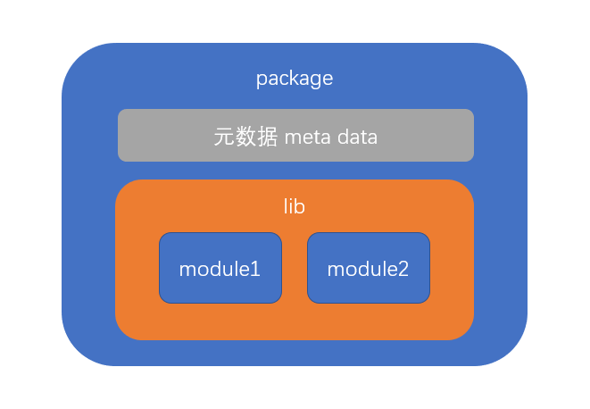

---
nav:
  title: 笔记
  path: /notes
group:
  title: 中枢-工程化
  order: 2
type:
  title: 包管理器
  order: 2
title: 包管理工具概述
order: 1
---

# 包管理工具概述

> 本门课程的前置知识：JavaScript、ES6、模块化、git
> 本门课程的所有代码均书写在 nodejs 环境中，不涉及浏览器环境

## 概念

**模块（module）**

通常以单个文件形式存在的功能片段，入口文件通常称之为**入口模块**或**主模块**

**库（library，简称lib）**

以一个或多个模块组成的完整功能块，为开发中某一方面的问题提供完整的解决方案

**包（package）**

包含元数据的库，这些元数据包括：名称、描述、git主页、许可证协议、作者、依赖等等

## 背景

CommonJS 的出现，使 node 环境下的 JS 代码可以用模块更加细粒度的划分。一个类、一个函数、一个对象、一个配置等等均可以作为模块，这种细粒度的划分，是开发大型应用的基石。

为了解决在开发过程中遇到的常见问题，比如加密、提供常见的工具方法、模拟数据等等，一时间，在前端社区涌现了大量的第三方库。这些库使用 CommonJS 标准书写而成，非常容易使用。

然而，在下载使用这些第三方库的时候，遇到难以处理的问题：

- **下载过程繁琐**
  - 进入官网或 github 主页
  - 找到并下载相应的版本
  - 拷贝到工程的目录中
  - 如果遇到有同名的库，需要更改名称
- **如果该库需要依赖其他库，还需要按照要求先下载其他库**
- **开发环境中安装的大量的库如何在生产环境中还原，又如何区分**
- **更新一个库极度麻烦**
- **自己开发的库，如何在下一次开发使用**

**以上问题，就是包管理工具要解决的问题**

## 前端包管理器

> 本门课程讲解的包管理器
> npm：重点
> yarn：次重点
> 其他：了解

几乎可以这样认为，前端所有的包管理器都是基于 npm 的，目前，npm 即是一个包管理器，也是其他包管理的基石

npm 全称为 node package manager，即 node 包管理器，它运行在 node 环境中，让开发者可以用简单的方式完成包的查找、安装、更新、卸载、上传等操作

> npm 之所以要运行在 node 环境，而不是浏览器环境，根本原因是因为浏览器环境无法提供下载、删除、读取本地文件的功能。而 node 属于服务器环境，没有浏览器的种种限制，理论上可以完全掌控运行 node 的计算机。

npm 的出现，弥补了 node 没有包管理器的缺陷，于是很快，node 在安装文件中内置了 npm，当开发者安装好 node 之后，就自动安装了 npm，不仅如此，node 环境还专门为 npm 提供了良好的支持，使用 npm 下载的包更加方便了。

npm 由三部分组成：

- registry：入口
  - 可以把它想象成一个庞大的数据库
  - 第三方库的开发者，将自己的库按照 npm 的规范，打包上传到数据库中
  - 使用者通过统一的地址下载第三方包
- 官网：https://www.npmjs.com/
  - 查询包
  - 注册、登录、管理个人信息
- CLI：command-line interface 命令行接口
  - 这一部分是本门课讲解的重点
  - 安装好 npm 后，通过 CLI 来使用 npm 的各种功能

> node 和 npm 是互相成就的，node 的出现让 npm 火了，npm 的火爆带动了大量的第三方库的发展，很多优秀的第三方库打包上传到了 npm，这些第三方库又为 node 带来了大量的用户
